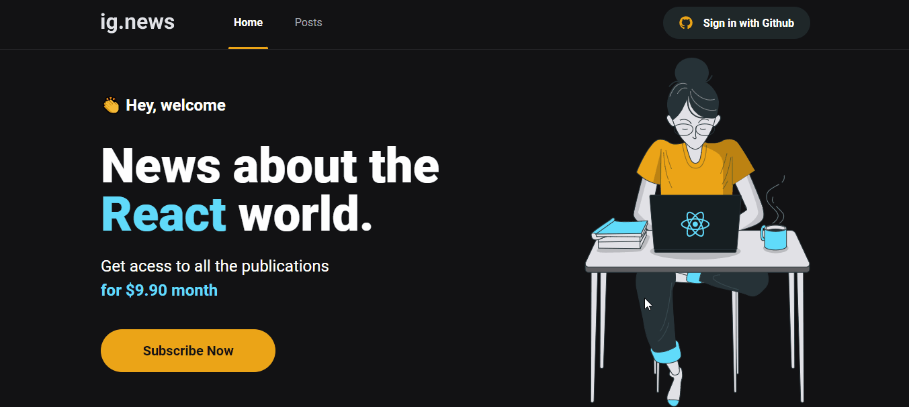

<h1 align="center">
  
</h1>

<h1 align="center">
    ig.news
</h1>

Aplicação para inscrição de newsletter com pagamento via stripe

## Sobre o projeto

O projeto tem como objetivo o estudo e desenvolvimento de uma aplicação em ReactJS com NextJS para listagem de posts e sistema de inscrição(subscription).

## Tecnologias

Abaixo as tecnologias utilizadas para construção da aplicação

- [ReactJS](https://reactjs.org/)
- [NextJS](https://nextjs.org/)
- [TypeScript](https://www.typescriptlang.org/)
- [SASS](https://sass-lang.com/)
- [Next-Auth](https://next-auth.js.org/)
- [Stripe](https://stripe.com/)
- [FaunaDB](https://fauna.com/)
- [Prismic CMS](https://prismic.io/)

---

## Licença

Distribuído sob a licença MIT. Veja [LICENSE](LICENSE) para mais informações.

---
